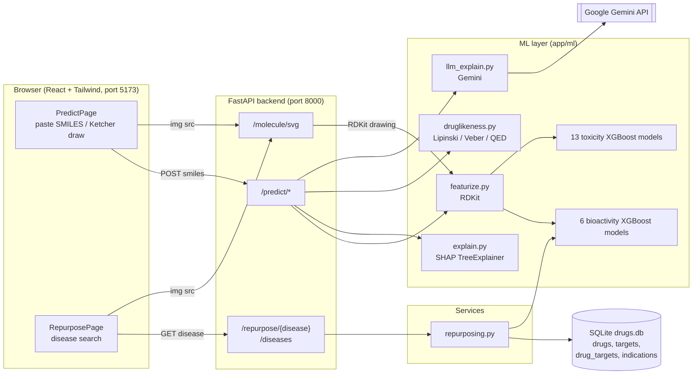
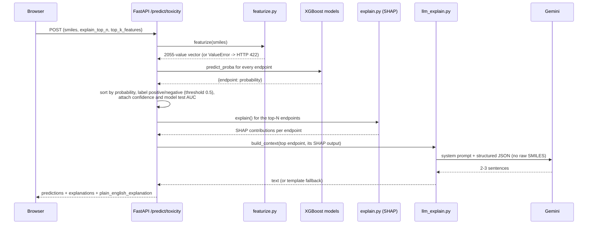
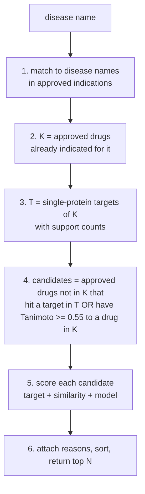

# Architecture

A complete technical description of the Drug Discovery App: what each part does, how the machine-learning
models are trained and used, how a prediction is produced end to end, how drug repurposing works, and where
the limits are. Numbers in this document come from the saved metrics files and the seeded database, not from estimates.

**Contents**

1. [What the app does](#1-what-the-app-does)
2. [System overview](#2-system-overview)
3. [Repository layout](#3-repository-layout)
4. [Tech stack and versions](#4-tech-stack-and-versions)
5. [Data sources and pipelines](#5-data-sources-and-pipelines)
6. [Featurization](#6-featurization)
7. [The machine-learning models](#7-the-machine-learning-models)
8. [How a prediction is made](#8-how-a-prediction-is-made)
9. [Explainability with SHAP](#9-explainability-with-shap)
10. [The plain-English explanation layer (Gemini)](#10-the-plain-english-explanation-layer-gemini)
11. [Drug-likeness](#11-drug-likeness)
12. [The repurposing engine](#12-the-repurposing-engine)
13. [Database schema](#13-database-schema)
14. [Backend API reference](#14-backend-api-reference)
15. [Frontend](#15-frontend)
16. [Testing](#16-testing)
17. [Configuration, security and operations](#17-configuration-security-and-operations)
18. [Design decisions and their reasons](#18-design-decisions-and-their-reasons)
19. [Known limitations](#19-known-limitations)
20. [What is not built](#20-what-is-not-built)
21. [Rebuilding everything from scratch](#21-rebuilding-everything-from-scratch)

---

## 1. What the app does

The app has two features.

**Predict a molecule.** The user pastes a SMILES string or draws a structure. The app returns:

- **Bioactivity**: the probability that the molecule inhibits each of six kinases (EGFR, ABL1, CDK2, SRC, VEGFR2, BRAF) at IC50 ≤ 1 µM.
- **Toxicity**: the probability of a positive result on 13 endpoints (12 Tox21 assays plus ClinTox clinical-trial toxicity).
- **Drug-likeness**: Lipinski's rule of five, Veber's rules and the QED score.
- **Explanations**: for every prediction, the features that pushed it up or down (SHAP), plus a 2–3 sentence plain-English summary written by Gemini from that SHAP output.

**Repurpose drugs for a disease.** The user enters a disease. The app returns a ranked list of *already approved*
drugs that might be worth investigating for it, each with reasons in plain language:

- "Shares target Tyrosine-protein kinase ABL1 with 5 known treatments: ASCIMINIB, BOSUTINIB, DASATINIB and 2 more"
- "Structurally similar (Tanimoto 0.78) to ALOGLIPTIN, approved for Diabetes Mellitus, Type 2"
- "Bioactivity model predicts 92% probability of ABL1 activity (IC50 <= 1 uM)"

All output is a computational hypothesis, not laboratory or clinical evidence. The UI and API say so.

---

## 2. System overview



Key properties of the design:

- **Stateless API.** Nothing is stored per user or per request. All models and the drug index are loaded into memory once at startup.
- **Models are files.** Trained models live in `backend/app/models/*.pkl` and are loaded with `joblib`.
- **The LLM never predicts anything.** It only rephrases structured model output (Section 10). If Gemini is down, the API still answers.
- **Structure images are drawn by the backend** (RDKit SVG), so the browser needs no chemistry library except the optional Ketcher editor.

---

## 3. Repository layout

```
drug_discovery/
├── ARCHITECTURE.md                 this file
├── README.md                       quick-start commands
├── .gitignore                      ignores .venv, node_modules, .env, data/*, *.pkl
├── .vscode/settings.json           points VS Code at backend/.venv
├── backend/
│   ├── requirements.txt            direct dependencies
│   ├── requirements.lock.txt       exact installed versions
│   ├── .env                        GEMINI_API_KEY (git-ignored, never committed)
│   ├── .env.example                blank template (tracked)
│   ├── app/
│   │   ├── main.py                 FastAPI app, CORS, startup warm-up, router registration
│   │   ├── routers/
│   │   │   ├── predict.py          POST /predict/bioactivity | toxicity | druglikeness
│   │   │   ├── repurpose.py        GET /repurpose/{disease}, GET /diseases
│   │   │   └── molecule.py         GET /molecule/svg
│   │   ├── ml/
│   │   │   ├── featurize.py        SMILES -> 2055-value feature vector
│   │   │   ├── train_bioactivity.py    trains 6 kinase models, writes bioactivity.pkl
│   │   │   ├── predict_bioactivity.py  loads bundle, scores a SMILES on each kinase
│   │   │   ├── train_toxicity.py       trains 13 toxicity models, writes toxicity.pkl
│   │   │   ├── predict_toxicity.py     loads bundle, scores a SMILES on each endpoint
│   │   │   ├── explain.py          SHAP contributions + Morgan-bit -> substructure mapping + plot
│   │   │   ├── llm_explain.py      Gemini prompt, grounded context, template fallback
│   │   │   └── druglikeness.py     Lipinski, Veber, QED
│   │   ├── services/
│   │   │   └── repurposing.py      disease matching, candidate generation, scoring, reasons
│   │   ├── db/
│   │   │   ├── models.py           SQLAlchemy schema + engine (data/drugs.db)
│   │   │   └── seed_data.py        loads the repurposing CSVs into SQLite
│   │   └── models/                 bioactivity.pkl, toxicity.pkl (+ *.metrics.json)
│   ├── scripts/
│   │   ├── download_chembl.py      kinase IC50 data -> data/chembl/kinase_activities.csv
│   │   └── download_repurposing.py approved drugs / mechanisms / indications / targets -> CSVs
│   ├── data/                       raw + processed data (git-ignored)
│   │   ├── chembl/kinase_activities.csv
│   │   ├── toxicity/tox21.csv.gz, clintox.csv.gz
│   │   ├── repurposing/drugs.csv, drug_targets.csv, indications.csv, targets.csv
│   │   └── drugs.db                SQLite knowledge base
│   └── tests/                      pytest suite (20 tests)
│       ├── test_api.py, test_repurpose.py, test_molecule.py
└── frontend/
    ├── index.html                  entry; inline script applies saved theme before first paint
    ├── vite.config.js              React + Tailwind plugins, `global`/`process.env` shims for Ketcher
    ├── .env.example                VITE_API_URL
    └── src/
        ├── main.jsx, App.jsx       router + header (nav, theme toggle)
        ├── index.css               Tailwind import + dark-mode colour remapping
        ├── api/client.js           all backend calls, error normalisation
        ├── pages/
        │   ├── PredictPage.jsx     molecule input -> predictions, SHAP, explanations
        │   └── RepurposePage.jsx   disease search -> ranked candidate cards
        └── components/
            ├── MoleculeInput.jsx   paste / draw tabs, examples, submit
            ├── KetcherEditor.jsx   Ketcher wrapper (lazy-loaded)
            ├── ResultCard.jsx      one endpoint's prediction card
            ├── ShapChart.jsx       diverging SHAP bar chart
            ├── StructureImage.jsx   of the backend SVG
            └── ThemeToggle.jsx     light/dark switch
```

---

## 4. Tech stack and versions

| Layer | Tool | Version (installed) | Role |
|---|---|---|---|
| Cheminformatics | RDKit | 2026.03 | SMILES parsing, fingerprints, descriptors, QED, structure drawing |
| ML | XGBoost | 3.4 | Gradient-boosted tree classifiers |
| ML utilities | scikit-learn | 1.9 | Metrics (ROC AUC, PR AUC, accuracy) |
| Explainability | SHAP | 0.52 | `TreeExplainer` on the XGBoost models |
| LLM | Gemini via `google-genai` | model `gemini-2.5-flash` (configurable) | Plain-English summaries |
| Backend | FastAPI + Uvicorn | 0.141 | REST API |
| Database | SQLite via SQLAlchemy | – | Repurposing knowledge base |
| Data handling | pandas, numpy, joblib, requests | – | Data prep, model persistence, downloads |
| Frontend | React 19, React Router 7, Tailwind CSS 4, Vite 8 | – | UI |
| Molecule drawing | Ketcher (`ketcher-react`, `ketcher-standalone`) 3.x | – | Draw structures in the browser |
| Runtime | Python 3.13, Node 22 | – | – |

---

## 5. Data sources and pipelines

All sources are free and public.

### 5.1 Kinase bioactivity (ChEMBL)

- **Script:** `backend/scripts/download_chembl.py` (ChEMBL REST API, `activity` endpoint).
- **Targets (one target family, kinases):** EGFR `CHEMBL203`, ABL1 `CHEMBL1862`, CDK2 `CHEMBL301`, SRC `CHEMBL267`, VEGFR2 `CHEMBL279`, BRAF `CHEMBL5145`.
- **Filters:** `standard_type = IC50`, `standard_relation = "="` (exact values only, no ">" or "<" censored data), and a curated `pchembl_value` present. Up to 2,000 activities per target.
- **De-duplication:** a compound measured several times on one target keeps the **median** pChEMBL value.
- **Result:** 8,762 (compound, target) rows covering 8,164 unique compounds, saved to `data/chembl/kinase_activities.csv`.
- **Label:** *active* if pChEMBL ≥ 6, i.e. IC50 ≤ 1 µM. The overall active rate is about 69%.

### 5.2 Toxicity (Tox21 and ClinTox from MoleculeNet)

- Downloaded as `tox21.csv.gz` and `clintox.csv.gz` from the DeepChem MoleculeNet S3 bucket into `backend/data/toxicity/`. There is no script for this step; the exact commands are in Section 21.
- **Tox21:** 7,831 molecules, 12 assays (labels are sparse: each assay labels only 5,800–7,300 molecules). Endpoints:

  | Endpoint | Meaning |
  |---|---|
  | NR-AR, NR-AR-LBD | Androgen receptor signalling / ligand-binding domain |
  | NR-AhR | Aryl hydrocarbon receptor activation |
  | NR-Aromatase | Aromatase inhibition |
  | NR-ER, NR-ER-LBD | Estrogen receptor signalling / ligand-binding domain |
  | NR-PPAR-gamma | PPAR-gamma activation |
  | SR-ARE | Oxidative stress response |
  | SR-ATAD5 | DNA damage response |
  | SR-HSE | Heat shock response |
  | SR-MMP | Mitochondrial membrane potential disruption |
  | SR-p53 | p53 pathway activation (genotoxic stress) |

- **ClinTox:** 1,484 molecules with two labels. Only `CT_TOX` (drug failed clinical trials due to toxicity, 7.5% positive) is used. Molecules RDKit cannot parse (a few contain wildcard atoms) are skipped, leaving 1,480.

### 5.3 Repurposing knowledge base (ChEMBL)

DrugBank's target and indication data requires a licensed account, so ChEMBL is used instead.

- **Script:** `backend/scripts/download_repurposing.py`. It pulls four datasets:

  | Endpoint | Filter | Raw size | Used for |
  |---|---|---|---|
  | `molecule` | `max_phase = 4` (approved) | 4,225 records | Drug structures and names |
  | `mechanism` | all | 7,561 records | Drug → target protein links |
  | `drug_indication` | `max_phase_for_ind = 4` | 8,683 records | Drug → disease (MeSH heading, else EFO term) |
  | `target` | targets appearing in mechanisms | – | Names, target type, UniProt accession |

- **Normalisation.** ChEMBL lists salts and hydrates as separate molecules, while mechanisms and indications are keyed by the *parent* molecule. The script maps every approved record to its parent, keeps small molecules with a structure, and stores the salt-free parent SMILES.
- **Result after filtering:** 2,197 approved drugs, 2,323 drug-target links (1,498 of them to single-protein targets), 5,398 approved indications over 855 distinct diseases, 597 targets.
- `python -m app.db.seed_data` loads the CSVs into SQLite (`data/drugs.db`) and precomputes each drug's fingerprint.

---

## 6. Featurization

**File:** `backend/app/ml/featurize.py`. Every model consumes the same 2,055-value vector.

```
feature vector (float32, length 2055)
├── [0..6]     7 physicochemical descriptors
│               MolWt, LogP, HBD, HBA, RingCount, TPSA, RotatableBonds
└── [7..2054]  2048-bit Morgan fingerprint (radius 2)
```

- **Parsing:** `parse_smiles` uses `Chem.MolFromSmiles`; invalid input raises `ValueError("Invalid SMILES: ...")`. The API turns that into HTTP 422.
- **Descriptors** (RDKit): molecular weight, Crippen LogP, H-bond donors and acceptors (Lipinski definitions), number of rings, topological polar surface area, rotatable bonds.
- **Morgan fingerprint** (also called ECFP4): each atom's neighbourhood out to 2 bonds is hashed, and the hash is folded into one of 2,048 bit positions. A set bit means "some substructure hashing to this position exists in the molecule". Different substructures can collide on the same bit; this matters for explanations (Section 9).
- **Feature names** are exposed as `FEATURE_NAMES` (7 descriptor names, then `morgan_0` … `morgan_2047`) so SHAP output can be labelled.
- `featurize_many` featurizes a list and skips invalid SMILES, returning which inputs were kept.

Why these features: fingerprints capture *what substructures are present* (strongly predictive of both activity and toxicity alerts), while the descriptors capture overall size, polarity and lipophilicity (which drive drug-likeness and cell permeability).

---

## 7. The machine-learning models

There are **19 XGBoost binary classifiers**: 6 for bioactivity (one per kinase) and 13 for toxicity (one per endpoint). All use the 2,055-value feature vector.

### 7.1 Why one model per target and endpoint

The first bioactivity version used a single model with the kinase as a one-hot input. It scored imatinib (an ABL1 drug) at about 0.79 on *every* kinase: the shared trees were dominated by molecule features, so the target flag barely mattered. Training six separate models fixed this: imatinib now scores ABL1 0.94 and EGFR 0.08. Toxicity has the same structure (different assays have different labelled molecules), so it uses one model per endpoint from the start.

### 7.2 Bioactivity models (`train_bioactivity.py`)

| Setting | Value |
|---|---|
| Algorithm | `XGBClassifier` |
| Trees / depth / learning rate | 300 / 5 / 0.05 |
| Row subsample / column subsample | 0.8 / 0.5 |
| Label | pChEMBL ≥ 6 → active |
| Random seed | 42 |
| Train/test split | scaffold split, ~20% test (7,001 train / 1,761 test rows) |
| Output artifact | `app/models/bioactivity.pkl` (dict: `models`, `targets`, `feature_names`, `active_pchembl`, `metrics`) plus `bioactivity.metrics.json` |

**Test results** (held-out scaffolds):

| Kinase | Test rows | Active rate | ROC AUC | Accuracy | Majority-class baseline |
|---|---|---|---|---|---|
| ABL1 | 244 | 75.4% | 0.927 | 0.869 | 0.754 |
| BRAF | 294 | 77.9% | 0.890 | 0.857 | 0.779 |
| CDK2 | 313 | 70.3% | 0.846 | 0.773 | 0.703 |
| EGFR | 269 | 62.5% | 0.923 | 0.836 | 0.625 |
| SRC | 340 | 58.5% | 0.889 | 0.803 | 0.585 |
| VEGFR2 | 301 | 78.1% | 0.770 | 0.807 | 0.781 |
| **Pooled** | 1,761 | – | **0.884** | **0.822** | – |

VEGFR2 is weak: its accuracy barely exceeds the baseline, though the AUC of 0.77 shows some ranking ability.

### 7.3 Toxicity models (`train_toxicity.py`)

Same algorithm and hyper-parameters, with one addition: `scale_pos_weight = (#negatives / #positives)` on the training rows, because positives are rare (3–16%). Each endpoint gets its own scaffold split over *its own labelled rows*. Artifact: `app/models/toxicity.pkl` (`models`, `descriptions`, `feature_names`, `metrics`) plus `toxicity.metrics.json`.

| Endpoint | Labelled train / test | Positive rate | ROC AUC | PR AUC | PR baseline (test positive rate) |
|---|---|---|---|---|---|
| NR-AR | 5,804 / 1,454 | 4.2% | 0.772 | 0.411 | 0.039 |
| NR-AR-LBD | 5,394 / 1,357 | 3.5% | 0.859 | 0.481 | 0.035 |
| NR-AhR | 5,234 / 1,308 | 11.7% | 0.851 | 0.562 | 0.164 |
| NR-Aromatase | 4,353 / 1,462 | 5.2% | 0.762 | 0.142 | 0.036 |
| NR-ER | 4,429 / 1,757 | 12.8% | 0.667 | 0.350 | 0.131 |
| NR-ER-LBD | 5,555 / 1,393 | 5.0% | 0.829 | 0.566 | 0.077 |
| NR-PPAR-gamma | 5,155 / 1,288 | 2.9% | 0.813 | 0.211 | 0.036 |
| SR-ARE | 3,262 / 2,563 | 16.2% | 0.764 | 0.388 | 0.133 |
| SR-ATAD5 | 5,652 / 1,413 | 3.7% | 0.756 | 0.155 | 0.038 |
| SR-HSE | 5,167 / 1,293 | 5.8% | 0.746 | 0.299 | 0.065 |
| SR-MMP | 3,555 / 2,249 | 15.8% | 0.849 | 0.598 | 0.178 |
| SR-p53 | 5,414 / 1,353 | 6.3% | 0.794 | 0.385 | 0.078 |
| ClinTox | 1,184 / 296 | 7.6% | 0.716 | 0.387 | 0.061 |

Mean ROC AUC over the 13 endpoints is **0.783**, in the range usually reported for Tox21 on scaffold splits. PR AUC is reported because ROC AUC can look good on rare positives; here PR AUC exceeds its baseline on all 13 endpoints. NR-ER (AUC 0.667) and ClinTox (0.716, only 296 test molecules) are the weakest.

### 7.4 Scaffold splitting (why the metrics are honest)

`scaffold_split` in `train_bioactivity.py` (reused by toxicity):

1. Compute each molecule's **Bemis–Murcko scaffold** (its ring systems and the linkers between them).
2. Group molecules by scaffold and shuffle the *groups* with a fixed seed.
3. Add whole groups to the test set until it holds about 20% of the rows; everything else is training data.

A random split would put close analogues (same scaffold) on both sides, letting the model "recognise" test molecules and inflating scores. Scaffold splitting tests the harder, realistic question: does the model generalise to new chemical series? The reported numbers are therefore lower and more trustworthy than random-split numbers.

### 7.5 Final models

After evaluation, each model is **refit on all its data** (train + test) before being saved, so the shipped models use every available example. The reported metrics come from the train-only versions, since a model evaluated on data it trained on would be meaningless.

---

## 8. How a prediction is made



Step by step for `POST /predict/bioactivity` and `/predict/toxicity` (`app/routers/predict.py`, function `_run`):

1. **Validate** the request (Pydantic): `smiles` 1–500 characters; `explain_top_n` 0–13 (default 3); `top_k_features` 1–25 (default 8); `include_llm_explanation` (default true).
2. **Featurize** the SMILES once per model call. Invalid SMILES → HTTP 422 with `Invalid SMILES: '...'`.
3. **Score** every model in the bundle: `predict_proba(x)[0, 1]` gives P(positive class). Bioactivity's positive class is *active*; toxicity's is *toxic*.
4. **Label**: probability ≥ 0.5 → positive label (`active` / `toxic`), otherwise negative (`inactive` / `non-toxic`).
5. **Confidence** = `max(p, 1 − p)`, the distance from the decision boundary. This is **not** a calibrated certainty (see Section 19). Each prediction also carries `model_test_auc`, the endpoint's held-out ROC AUC, so the reader can judge how much to trust that particular model.
6. **Sort** endpoints by probability, highest first.
7. **Explain** the top `explain_top_n` endpoints with SHAP (Section 9).
8. **Summarise** the single top endpoint in plain English (Section 10) and attach it as `plain_english_explanation`.
9. Toxicity additionally returns `flagged_endpoints` (all positive endpoints) and `overall` (`"toxicity alerts"` / `"no toxicity alerts"`). Bioactivity returns a `threshold` note (`active = IC50 <= 1 uM (pIC50 >= 6)`).

**Model loading.** The bundles are loaded once by `load_bundle()` (cached with `lru_cache`) and warmed at server startup in `main.py`'s lifespan handler. A request costs about 0.3–0.4 s without the LLM call; Gemini adds about 2.5 s.

**The command-line equivalents** exercise the same code without the server:
`python -m app.ml.predict_bioactivity "<SMILES>"`, `python -m app.ml.predict_toxicity "<SMILES>"`.

---

## 9. Explainability with SHAP

**File:** `backend/app/ml/explain.py`.

### 9.1 What SHAP gives

SHAP assigns each feature a contribution to one prediction such that

```
baseline (log-odds)  +  Σ feature contributions  =  the model's raw output (log-odds)
probability          =  sigmoid(raw output)
```

For tree ensembles, `shap.TreeExplainer` computes these exactly and quickly. Contributions are in **log-odds** (XGBoost's native margin): a positive value pushes the prediction toward the positive class (active / toxic), a negative value pushes away. The baseline is the model's average output over its training data; `base_probability` in the response is `sigmoid(baseline)`.

The additivity identity is verified: for erlotinib on EGFR, `sigmoid(baseline + Σ SHAP)` reproduces the model probability exactly (0.963).

### 9.2 Making Morgan bits readable

A raw SHAP result would say "`morgan_1057` contributes +0.9", which means nothing to a reader. `bit_fragments()` recovers, for each set bit, *one substructure that produced it*, using RDKit's bit-info map from the fingerprint generator:

- Radius 0 (single atom): labelled `atom N`.
- Radius ≥ 1: the atom environment is extracted (`FindAtomEnvironmentOfRadiusN`) and written as a SMILES fragment, e.g. `cNc(cc)cc`.

The output label is then `contains substructure cNc(cc)cc`. Descriptor features are labelled with their value, e.g. `TPSA = 74.73`.

### 9.3 What is reported

- Only features that are **present** are listed: the 7 descriptors and the fingerprint bits that are set. Absent bits (the vast majority) carry no readable meaning.
- Contributions are sorted by absolute value and cut to `top_k_features` (default 8; the frontend also uses 8).
- Each item: `feature`, `label`, `type` (`descriptor` / `substructure`), `value`, `shap`, `direction` (`increases` / `decreases`).
- The response also carries `probability`, `base_probability` and `base_logit`.

### 9.4 Caveats

- One fragment is shown per bit even if several parts of the molecule (or different substructures colliding on the same folded bit) share it.
- SHAP explains **what the model associates with the outcome**, not biological mechanism. A small fragment such as `CCO` scoring high for EGFR is a statistical association in this dataset, not a claim about how the drug works.
- Command-line check: `python -m app.ml.explain "<SMILES>" bioactivity EGFR` prints the contributions and saves a bar chart PNG to `backend/data/`.

---

## 10. The plain-English explanation layer (Gemini)

**File:** `backend/app/ml/llm_explain.py`. Goal: turn SHAP output into 2–3 readable sentences **without letting the language model invent science**.

### 10.1 Grounding

The LLM never sees the molecule and never predicts anything. `build_context()` assembles the only data it receives:

```json
{
  "prediction_type": "toxicity",
  "endpoint": "NR-ER",
  "endpoint_description": "Estrogen receptor signaling",
  "predicted_class": "toxic",
  "probability_of_positive_class": 0.9447,
  "baseline_probability_for_average_molecule": 0.537,
  "model_test_auc": 0.667,
  "top_shap_features": [
    {"feature": "contains substructure cccc(O)c", "effect": "increases", "shap_log_odds": 1.075}
  ],
  "other_endpoints_also_flagged": ["SR-MMP", "SR-ARE"]
}
```

The system prompt enforces:

- Use **only** the provided data; add no biological mechanisms, drug facts, disease links or chemistry from memory.
- Describe features as "the model associates X with Y", never as proven causes.
- Mention the probability; quote the AUC number but use no reliability adjectives such as "highly reliable"; add "only moderately reliable" only when the AUC is below 0.75.
- The final sentence must always be exactly: *"This is a computational prediction, not a lab result."*
- 2–3 sentences, no markdown.

### 10.2 Call settings

Model `gemini-2.5-flash` (override with the `GEMINI_MODEL` environment variable), temperature 0.2, at most 1,024 output tokens, thinking disabled (`thinking_budget = 0`), 30-second timeout. The key is read from `GEMINI_API_KEY` in `backend/.env`.

### 10.3 Failure handling

Any failure (missing key, network error, timeout, empty reply) is caught and logged, and a deterministic **template explanation** built from the same structured data is returned instead. The response says which one was used:

```json
"plain_english_explanation": {"text": "...", "source": "gemini", "model": "gemini-2.5-flash"}
"plain_english_explanation": {"text": "...", "source": "template", "model": null}
```

The prediction API therefore never fails because of the LLM. Send `"include_llm_explanation": false` to skip the call (the tests do this).

### 10.4 What is and is not guaranteed

The prompt and the structured input strongly constrain the output, and spot checks stayed within the data. There is no automated check that the generated wording is faithful, so treat the summary as a readable view of the SHAP list, not an independent source.

---

## 11. Drug-likeness

**File:** `backend/app/ml/druglikeness.py`. Rule-based; no trained model, no SHAP.

| Rule set | Checks | Pass condition |
|---|---|---|
| Lipinski's rule of five | MolWt ≤ 500, LogP ≤ 5, H-bond donors ≤ 5, H-bond acceptors ≤ 10 | at most **1** violation |
| Veber | TPSA ≤ 140, rotatable bonds ≤ 10 | **both** pass |
| QED | RDKit quantitative estimate of drug-likeness, 0–1 | reported, not thresholded |

`drug_like` is true when Lipinski allows at most one violation **and** Veber passes. Each rule is returned with its value, limit and pass/fail so the UI can show it. Erlotinib, for example, passes everything with QED 0.42.

---

## 12. The repurposing engine

**File:** `backend/app/services/repurposing.py`. Data: the SQLite knowledge base (Section 13).

### 12.1 Idea

A drug approved for one disease may help another if it acts on the **same target protein** as the existing treatments, or if it is **structurally similar** to them. The engine implements this as:



### 12.2 Step 1: matching the disease name

Diseases are MeSH headings (e.g. `Leukemia, Myelogenous, Chronic, BCR-ABL Positive`). User input is normalised to lower-case word stems (trailing "s" stripped) after applying synonyms:

- Phrase synonyms: "high blood pressure" → hypertension; "type 2 diabetes" → diabetes mellitus type 2; "chronic myeloid leukemia"/"cml" → the BCR-ABL MeSH heading; "acute myeloid leukemia"/"aml"; "heart attack"; "flu"; "depression" and others.
- Word synonyms: cancer/tumor/tumour → neoplasm.

Matching then tries, in order:

1. **Exact** stem match.
2. **Subset** match (all query words appear in the disease name); among those, only names with the **fewest words** are kept, to prefer the most general match.
3. **Word-overlap fallback**: Jaccard similarity ≥ 0.5 on stems, best matches only (handles e.g. "chronic myeloid leukemia" style variations).
4. Otherwise no match: the API returns 404 with up to 5 "did you mean" names from `difflib` (cutoff 0.7).

All matched diseases are pooled, and `matched_diseases` in the response shows exactly which ones were used.

### 12.3 Steps 2–3: known treatments and targets

- **K** = every drug with an approved indication for a matched disease.
- **T** = the union of their **single-protein** targets. Targets of type DNA, protein complex, organism, etc. are excluded, because "shares target: DNA" is not a meaningful repurposing reason.
- `target_support[t]` = the number of drugs in K acting on target *t*.

### 12.4 Step 4: candidates

A drug **not in K** becomes a candidate if either:

- it hits at least one target in T (a *shared target*), or
- its Tanimoto similarity to some drug in K is ≥ **0.55** (`SIMILARITY_ONLY_MIN`).

Tanimoto similarity is computed on the stored 2,048-bit Morgan fingerprints for all candidates × all known drugs at once with a matrix product: `intersection / (|A| + |B| − intersection)`.

### 12.5 Step 5: scoring

Three signals, each in [0, 1]:

| Signal | Definition | Weight |
|---|---|---|
| `target` | for the candidate's shared targets, the best `support(t) / max support over T`. The target that most known treatments act on scores 1.0. | 0.5 |
| `similarity` | max Tanimoto to any drug in K | 0.3 |
| `model` | the bioactivity model's P(active) for the candidate on a shared target, **only when that target is one of the six modelled kinases** (matched by ChEMBL ID) | 0.2 |

`score = Σ (weight × signal) / Σ weights` over the signals that exist, so when the model signal is unavailable the remaining weights are renormalised (0.5 and 0.3 become 0.625 and 0.375). Scores lie in [0, 1]. For non-kinase diseases the score therefore has no ML component; it is target overlap plus fingerprint similarity.

### 12.6 Step 6: reasons

Each candidate carries human-readable reasons generated from the same numbers:

- Up to two shared-target reasons, strongest first: `Shares target <name> [UniProt <accession>] with N known treatment(s) for <disease>: <up to 3 names> and M more`.
- A similarity reason when Tanimoto ≥ 0.40: `Structurally similar (Tanimoto 0.78) to <known drug>, approved for <disease>`.
- A model reason when available: `Bioactivity model predicts 92% probability of ABL1 activity (IC50 <= 1 uM)`.

The response also includes the underlying `signals`, the `shared_targets`, the `most_similar_known_drug` (name, ChEMBL ID, SMILES, Tanimoto, used by the UI to draw the side-by-side structures), and `currently_approved_for` (up to 5 of the candidate's own indications).

### 12.7 Performance

The index (fingerprint matrix, target and disease maps) is built once from SQLite and cached in memory; a query takes roughly 0.2–2 s, the upper end when many kinase candidates need model scoring.

### 12.8 Worked example: chronic myeloid leukemia

- Matches `Leukemia, Myelogenous, Chronic, BCR-ABL Positive`: 8 known treatments (imatinib, dasatinib, nilotinib, ponatinib, bosutinib, asciminib, busulfan, hydroxyurea).
- Their main target is ABL1 (5 known drugs), then KIT (2).
- 13 candidates. **Regorafenib** ranks first (score 0.75: target 1.0, similarity 0.23, model 0.92) because it shares ABL1 and KIT with the known drugs and the ABL1 model scores it 0.92. Sorafenib and pazopanib follow through shared KIT and PDGFR-beta.

---

## 13. Database schema

SQLite file `backend/data/drugs.db`, defined in `app/db/models.py` (SQLAlchemy 2 declarative). It is rebuilt from the CSVs by `app.db.seed_data` (drops and recreates all tables).

| Table | Columns | Rows |
|---|---|---|
| `drugs` | `id` (ChEMBL parent ID, PK), `name`, `smiles`, `fingerprint` (BLOB: 2,048 bits packed into 256 bytes), `first_approval` | 2,197 |
| `targets` | `id` (ChEMBL target ID, PK), `name`, `target_type`, `uniprot` (`;`-separated accessions) | 597 |
| `drug_targets` | `drug_id` → drugs, `target_id` → targets (composite PK), `action_type`, `mechanism`; index on `target_id` | 2,323 |
| `indications` | `id` (PK), `drug_id` → drugs, `disease`, `disease_norm` (lower-case, indexed), `mesh_id` | 5,398 |

The repurposing service reads these tables once into in-memory structures; nothing is written at request time. SQLite is sufficient at this size. Moving to PostgreSQL would only require changing the engine URL in `db/models.py`.

---

## 14. Backend API reference

Base URL `http://localhost:8000`. Interactive documentation with a "Try it out" button: `/docs`. CORS allows `http://localhost:5173` and `http://127.0.0.1:5173`.

| Method | Path | Purpose |
|---|---|---|
| GET | `/health` | Liveness check → `{"status": "ok"}` |
| POST | `/predict/bioactivity` | Per-kinase predictions + SHAP + explanation |
| POST | `/predict/toxicity` | 13 toxicity endpoints + SHAP + explanation |
| POST | `/predict/druglikeness` | Lipinski / Veber / QED |
| GET | `/repurpose/{disease}?top_n=10` | Ranked repurposing candidates (`top_n` 1–50) |
| GET | `/diseases?q=&limit=15` | Disease-name search for the UI dropdown, most-treated first (`limit` 1–50) |
| GET | `/molecule/svg?smiles=&width=320&height=240` | Structure image (SVG, transparent background, cached 24 h) |

### 14.1 `POST /predict/bioactivity` and `/predict/toxicity`

Request:

```json
{"smiles": "CC(C)(c1ccc(O)cc1)c1ccc(O)cc1", "explain_top_n": 3, "top_k_features": 8, "include_llm_explanation": true}
```

Response (abridged; values are from bisphenol A, and the `feature` id is illustrative):

```json
{
  "smiles": "...",
  "predictions": [
    {"endpoint": "NR-ER-LBD", "description": "Estrogen receptor (ligand-binding domain)",
     "probability": 0.9814, "prediction": "toxic", "confidence": 0.9814, "model_test_auc": 0.829}
  ],
  "explanations": [
    {"kind": "toxicity", "endpoint": "NR-ER", "smiles": "...", "probability": 0.9447,
     "base_probability": 0.537, "base_logit": 0.148,
     "contributions": [
       {"feature": "morgan_123", "label": "contains substructure cccc(O)c", "type": "substructure",
        "value": 1.0, "shap": 1.075, "direction": "increases"}]}
  ],
  "plain_english_explanation": {"text": "...", "source": "gemini", "model": "gemini-2.5-flash"},
  "flagged_endpoints": ["NR-ER-LBD", "SR-MMP"],
  "overall": "toxicity alerts"
}
```

`flagged_endpoints` / `overall` appear on toxicity only; `threshold` appears on bioactivity only.

### 14.2 `POST /predict/druglikeness`

Request `{"smiles": "..."}`. Response: `lipinski` (`violations`, `passes`, `rules[]`), `veber` (`passes`, `rules[]`), `qed`, `drug_like`, `summary`.

### 14.3 `GET /repurpose/{disease}`

Response (abridged): `query`, `matched_diseases[]`, `known_treatments[]`, `known_treatment_targets[]` (top 10 with `n_known_drugs`), `n_candidates`, `candidates[]`, `weights_note`, `disclaimer`. Each candidate: `drug`, `chembl_id`, `smiles`, `score`, `signals{target, similarity, model?}`, `shared_targets[]`, `most_similar_known_drug{name, chembl_id, smiles, tanimoto}`, `currently_approved_for[]`, `reasons[]`.

### 14.4 Error responses

| Status | When | Body |
|---|---|---|
| 422 | Invalid SMILES; missing/empty field; parameter out of range | `{"detail": "Invalid SMILES: 'xyz'"}` (or FastAPI validation detail) |
| 404 | `/repurpose/...` with no matching disease | `{"detail": "No disease matching 'leukimia' ... Did you mean: Leukemia?"}` |
| 405 | Wrong HTTP method (e.g. POST to `/repurpose/...`; `/predict/*` are POST only) | `{"detail": "Method Not Allowed"}` |
| 503 | A model file or the repurposing database is missing | `{"detail": "... run its training script"}` |

The generic `{"detail": "Not Found"}` (404) means the URL path itself does not exist.

---

## 15. Frontend

React 19 single-page app built with Vite; styling is Tailwind CSS 4 utility classes. Routes (React Router): `/predict` (default), `/repurpose`.

### 15.1 Predict page (`pages/PredictPage.jsx`)

1. `MoleculeInput` collects a SMILES (paste tab, or the Ketcher drawing tab). Five one-click examples are provided. In draw mode the SMILES is read from the editor with `ketcher.getSmiles()`; switching tabs carries the molecule across.
2. `analyzeMolecule` (`api/client.js`) calls the three endpoints **in parallel** (`Promise.all`): bioactivity with `explain_top_n = 6`, toxicity with `explain_top_n = 13` (so every card has a SHAP breakdown ready), and drug-likeness.
3. Results layout: left column with the structure image and the drug-likeness card; right column with a **Bioactivity** and a **Toxicity** section. Each section shows the Gemini summary, a grid of `ResultCard`s (probability bar, label, held-out test AUC), and a `ShapChart` for the selected card. Clicking a card switches the chart.
4. Loading and error states are shown explicitly; an invalid SMILES shows the backend's message.

### 15.2 Repurpose page (`pages/RepurposePage.jsx`)

- Search box with a debounced (200 ms) autocomplete backed by `/diseases?q=`, showing how many approved drugs each disease has; Escape closes the list; example chips for quick tries.
- Result header: matched disease name(s), number of known treatments and candidates, and an expandable list of known treatments and their main targets.
- One card per candidate, ranked: score bar, "why" bullet list, signal chips, and **side-by-side structures** of the candidate and its most similar known drug (with the Tanimoto value in the caption).
- "Show more (up to 50)" re-queries with a larger `top_n`. The disclaimer is always shown.

### 15.3 Components

| Component | Responsibility |
|---|---|
| `MoleculeInput` | Paste/draw tabs, examples, validation, submit |
| `KetcherEditor` | Ketcher (`ketcher-react` + `ketcher-standalone`, an in-browser chemistry service); **lazy-loaded** with `React.lazy` because Ketcher is several MB |
| `ResultCard` | One endpoint: badge, probability bar, test AUC; selectable |
| `ShapChart` | Diverging bar chart (red = toward positive class, blue = away), values in SHAP log-odds |
| `StructureImage` | `` pointing at `/molecule/svg`; graceful fallback if it fails |
| `ThemeToggle` | Light/dark switch |

### 15.4 API client (`api/client.js`)

All network access goes through one `request()` helper that: prefixes `VITE_API_URL` (default `http://localhost:8000`), turns FastAPI's `detail` (string or validation list) into a readable `Error.message`, and reports "Cannot reach the backend…" when the server is down.

### 15.5 Dark mode

Implemented by re-mapping Tailwind's colour variables under a `.dark` class in `index.css` (slate/indigo/rose/emerald/sky/amber), so the existing utility classes switch without `dark:` variants everywhere. The initial theme follows the OS (`prefers-color-scheme`); the toggle stores an explicit choice in `localStorage` (wrapped in `try/catch`); an inline script in `index.html` applies it before first paint to avoid a flash. Structure drawings keep a white frame (they are drawn in dark lines), and Ketcher keeps its own light canvas.

### 15.6 Structure images

The browser never runs chemistry code for images: `GET /molecule/svg` draws with RDKit's `MolDraw2DSVG` on a transparent background. Images below the fold use `loading="lazy"`.

---

## 16. Testing

**Backend automated tests:** `cd backend` then `.venv\Scripts\python -m pytest tests -q` → **20 passed**.

| File | Covers |
|---|---|
| `tests/test_api.py` | health; bioactivity (erlotinib → EGFR active); toxicity (bisphenol A flags NR-ER); drug-likeness; invalid SMILES → 422 on all three; request validation; LLM context is structured and grounded (Gemini mocked); LLM opt-out; template fallback when the key is missing |
| `tests/test_repurpose.py` | disease-name normalisation and synonyms; disease matching and suggestions; Tanimoto(imatinib, imatinib) = 1; CML repurposing (known treatments include imatinib, candidates sorted, none already indicated, reasons mention "Shares target", ABL1 is a known target); Tanimoto cited in reasons; 404 with suggestion; `top_n` validation; disease search ordering; similar-known-drug carries a structure |
| `tests/test_molecule.py` | SVG endpoint and invalid SMILES |

The repurposing tests are skipped automatically if `data/drugs.db` has not been built.

**ML sanity checks** (also documented in Section 21): the command-line predictors on molecules with known behaviour — erlotinib should peak on EGFR, imatinib on ABL1 with EGFR near zero, aspirin low everywhere, bisphenol A flagged on the estrogen-receptor endpoints, benzo[a]pyrene on the aryl hydrocarbon receptor.

**Frontend:** there is no automated test suite in the repository. The UI was exercised end to end in a real browser (Edge driven by Playwright) during development: prediction flow, SHAP switching, invalid input, Ketcher draw → analyze, disease autocomplete, repurposing cards, dark mode and persistence. That script is not part of the repo.

---

## 17. Configuration, security and operations

**Configuration**

| Variable | File | Purpose |
|---|---|---|
| `GEMINI_API_KEY` | `backend/.env` | Key for the explanation layer. Optional at runtime: without it the template fallback is used |
| `GEMINI_MODEL` | `backend/.env` | Optional model override (default `gemini-2.5-flash`) |
| `VITE_API_URL` | `frontend/.env` | Backend base URL (default `http://localhost:8000`) |

**Secrets.** `backend/.env` is git-ignored. Only `.env.example` templates (blank values) are tracked, and the git history contains no API key. Never paste a real key into an `.env.example` file.

**Input safety.** SMILES length is capped at 500 characters; numeric parameters have hard bounds; invalid molecules are rejected before any model runs. The LLM receives only computed numbers and RDKit-generated fragment strings, not user text, which limits prompt-injection surface.

**Running locally**

```powershell
# terminal 1
cd backend
.venv\Scripts\python -m uvicorn app.main:app --reload
# terminal 2
cd frontend
npm run dev            # http://localhost:5173
```

Run from `backend` with the venv's Python: the `app` package lives there and the ML libraries are installed only in `backend\.venv`.

**Startup behaviour.** The FastAPI lifespan handler pre-loads both model bundles and the repurposing index. A missing model file or database does not stop the server; the affected endpoint returns 503 until it is built.

---

## 18. Design decisions and their reasons

| Decision | Reason |
|---|---|
| **One model per kinase / endpoint** instead of one shared model | A shared model with a one-hot target ignored the target (imatinib scored ~0.79 on all kinases). Separate models produce target-specific answers, which repurposing depends on. |
| **Scaffold split** for evaluation | Random splits leak close analogues and overstate performance. |
| **Refit on all data** for the shipped models | Uses every example; evaluation numbers come from the train-only versions. |
| **XGBoost on fingerprints + descriptors** | Strong baseline for small-molecule property prediction, fast to train, and supported by exact TreeExplainer SHAP values. |
| **Morgan-bit → substructure mapping** | Makes SHAP output human-readable and gives the LLM meaningful, checkable features. |
| **LLM only rephrases structured data** | Prevents invented biology; the numbers and features come from the models, not the language model. |
| **Deterministic template fallback** | The prediction API must not depend on a third-party service's availability. |
| **ChEMBL instead of DrugBank** | DrugBank's target and indication data needs a licensed account; ChEMBL exposes approved drugs, mechanisms and indications freely through its API. |
| **Gemini instead of Claude** | Requested by the project owner; the LLM layer is one small module, easy to swap. |
| **Single-protein targets only** for shared-target reasons | "Shares target: DNA" or a large protein complex is not a meaningful repurposing rationale. |
| **Backend-rendered structure images** | Avoids shipping a multi-MB WASM chemistry library to every visitor; images are cacheable. |
| **Lazy-loaded Ketcher** | The editor is large and only needed on the Draw tab. |
| **Colour-variable dark mode** | Switches every component consistently without editing each class. |
| **SQLite** | Data is small (≈1.7 MB) and read-only at request time. |

---

## 19. Known limitations

**Models**

- **Kinase-only bioactivity.** The six models know only kinase chemistry. A molecule far from kinase inhibitors still gets six probabilities; there is no applicability-domain check to say "outside what this model knows".
- **Weak spots:** VEGFR2 (accuracy ≈ baseline, AUC 0.77), NR-ER (AUC 0.67), ClinTox (AUC 0.72 on 296 test molecules).
- **ClinTox labels are noisy.** Aspirin is labelled `CT_TOX = 1` (not approved) in the dataset, and the model reproduces that (≈0.85 "fails clinical trials due to toxicity"). On 300 other approved non-toxic drugs the model flags only 2%, but the endpoint is unreliable.
- **ClinTox can dominate the toxicity summary.** The plain-English toxicity explanation covers the highest-scoring endpoint, which is often ClinTox; erlotinib, an approved drug, was summarised as ~95% likely to fail trials due to toxicity. Ranking Tox21 endpoints ahead of ClinTox for the headline, and labelling ClinTox low-confidence, is a recommended fix.
- **Probabilities are not calibrated.** The toxicity models use `scale_pos_weight`, which shifts probabilities upward, so the 0.5 threshold flags more molecules than a calibrated model would (erlotinib flags seven of the 13 endpoints). "Confidence" is `max(p, 1 − p)`, not a probability that the answer is correct. Use `model_test_auc`, and treat probabilities as ranking scores.
- **Known drugs may be in the training data.** Well-known molecules such as erlotinib and imatinib probably appear in the ChEMBL training set, so sanity checks on them are not independent tests.
- **Small, single-family data.** 8,762 kinase measurements across six targets; results say nothing about other target classes.
- **Activity threshold.** "Active" is IC50 ≤ 1 µM from mixed assay types in ChEMBL, which is a simplification.

**Explanations**

- SHAP explains the model, not the biology. Fragment labels show one example occurrence per bit, and folded bits can collide.
- The Gemini summary is constrained but not automatically verified.

**Repurposing**

- **Near-duplicates rank high.** For breast cancer the top hits are estradiol esters and salts: they share the estrogen receptor and look like estradiol. This follows from the scoring but is not an interesting repurposing finding. A filter for near-identical variants (or a Tanimoto ceiling) would help.
- **Model signal is kinase-only** (6 of 597 targets); for other diseases the score is target overlap plus similarity.
- **Disease matching is lexical** over MeSH headings. Unusual phrasings can miss, and broad terms (e.g. "Neoplasms") pool many drugs.
- **Indications reflect ChEMBL's curation**, which is incomplete; "approved for" is not a full label.
- **No efficacy, dosing, safety or contraindication reasoning.** Outputs are hypotheses to investigate, not treatment advice.

**Engineering**

- No frontend automated tests. No authentication or rate limiting (fine locally; needed before public deployment). Gemini calls add ~2.5 s per request and cost API quota.
- `npm audit` reports high-severity advisories that come from Ketcher's dependency tree; they are not fixed automatically because forcing updates can break the editor.

---

## 20. What is not built

From the original project plan:

- **PDB / UniProt integration beyond accession IDs.** UniProt accessions are stored and displayed, but no protein sequence or structure data is used.
- **DrugBank** (replaced by ChEMBL, see Section 18).
- **PostgreSQL** (SQLite is used).
- **Deployment** (Render/Railway backend, Vercel frontend); only local running is set up.
- **Stretch goal: generative molecule design** (REINVENT / VAE).
- **LLM explanations on the repurposing endpoint** (the reasons there are template-generated from the scoring signals, not written by Gemini).

---

## 21. Rebuilding everything from scratch

Run from `backend` unless stated. Order matters.

```powershell
# 0. environment
python -m venv .venv
.venv\Scripts\python -m pip install -r requirements.txt
copy .env.example .env                 # then put GEMINI_API_KEY in .env (optional)

# 1. bioactivity data + models
.venv\Scripts\python scripts\download_chembl.py          # -> data/chembl/kinase_activities.csv
.venv\Scripts\python -m app.ml.train_bioactivity         # -> app/models/bioactivity.pkl

# 2. toxicity data + models (no download script; fetch the two MoleculeNet files)
mkdir data\toxicity
curl.exe -L -o data\toxicity\tox21.csv.gz   https://deepchemdata.s3-us-west-1.amazonaws.com/datasets/tox21.csv.gz
curl.exe -L -o data\toxicity\clintox.csv.gz https://deepchemdata.s3-us-west-1.amazonaws.com/datasets/clintox.csv.gz
.venv\Scripts\python -m app.ml.train_toxicity            # -> app/models/toxicity.pkl

# 3. repurposing knowledge base
.venv\Scripts\python scripts\download_repurposing.py     # -> data/repurposing/*.csv
.venv\Scripts\python -m app.db.seed_data                 # -> data/drugs.db

# 4. verify
.venv\Scripts\python -m pytest tests -q                  # 20 passed
```

Then start the servers as in Section 17. Training is deterministic (fixed seeds), so the metrics reproduce as long as the source datasets do; note that ChEMBL is a live database, so a fresh download can differ slightly from the snapshot used here.

**Command-line checks for each ML piece**

```powershell
.venv\Scripts\python -m app.ml.featurize "CC(=O)Oc1ccccc1C(=O)O"                  # feature vector
.venv\Scripts\python -m app.ml.predict_bioactivity "<SMILES>"                      # 6 kinase scores
.venv\Scripts\python -m app.ml.predict_toxicity "<SMILES>"                         # 13 toxicity scores
.venv\Scripts\python -m app.ml.explain "<SMILES>" bioactivity EGFR                 # SHAP + PNG
.venv\Scripts\python -m app.ml.druglikeness "<SMILES>"                             # Lipinski/Veber/QED
.venv\Scripts\python -m app.ml.llm_explain "<SMILES>" bioactivity                  # live Gemini call
```

Replace `<SMILES>` with a real structure, for example erlotinib `COCCOc1cc2ncnc(Nc3cccc(C#C)c3)c2cc1OCCOC`, bisphenol A `CC(C)(c1ccc(O)cc1)c1ccc(O)cc1`, or aspirin `CC(=O)Oc1ccccc1C(=O)O`.
